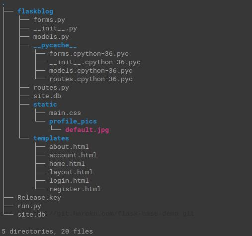
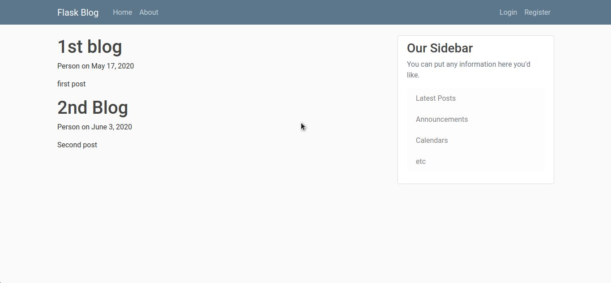
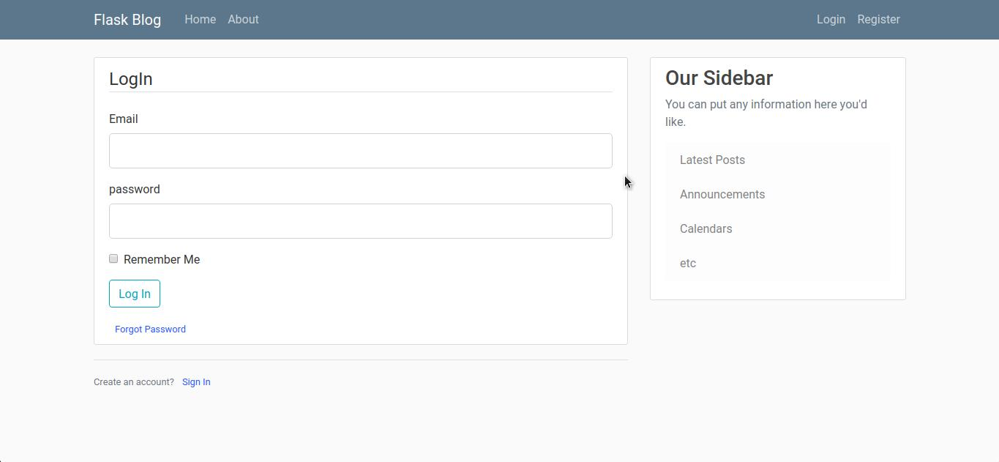
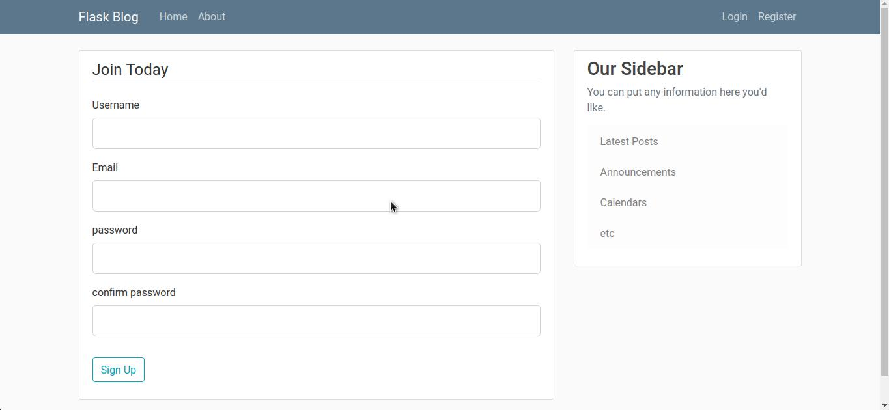

This repo contains the source code to a complete social blogging applications with Flask, a python microframework from ground up.

This app is implemented based on miguelgrinberg and Corey.

### Tree


### What's Included
* User Authentication
* User Roles
* User Profiles
* Blog Posts
* Followers
* User Comments
* API
* Email
* Unit Testing

#### Initialize a virtualenv


```bash
$ pip install virtualenv
$ virtualenv -p python3 env
$ source env/bin/activate
```

#### Run The File
```bash
$ python3 run.py
```

#### Some Demo Output




##### Caution
Yet the flask app is not built fully i am continue to update this repo.
